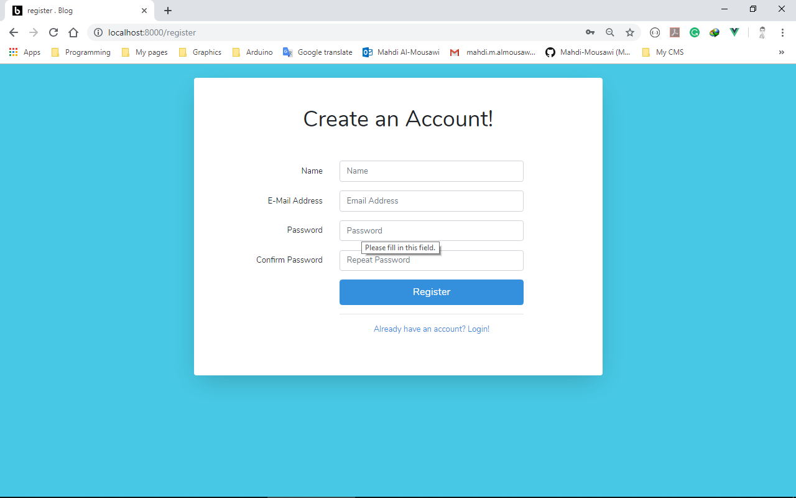
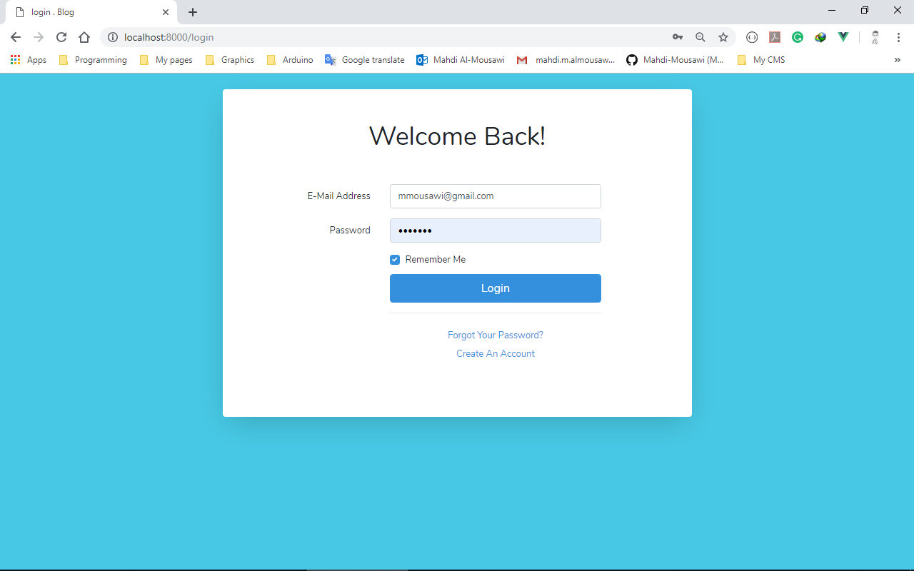
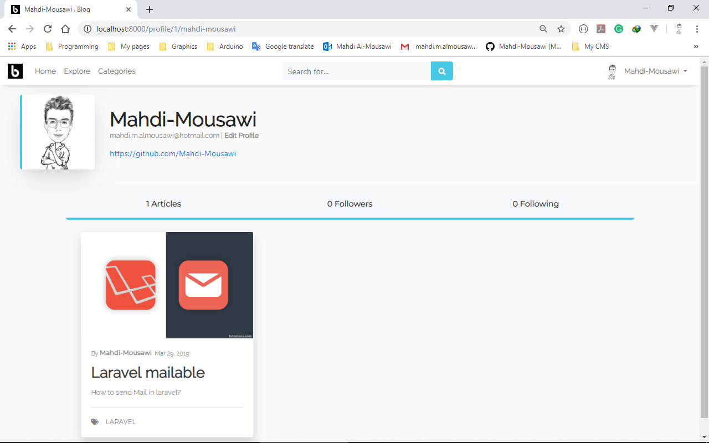
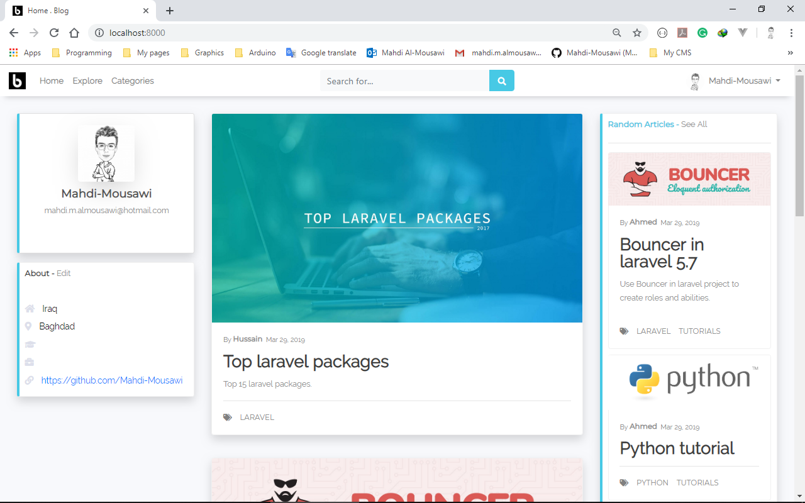
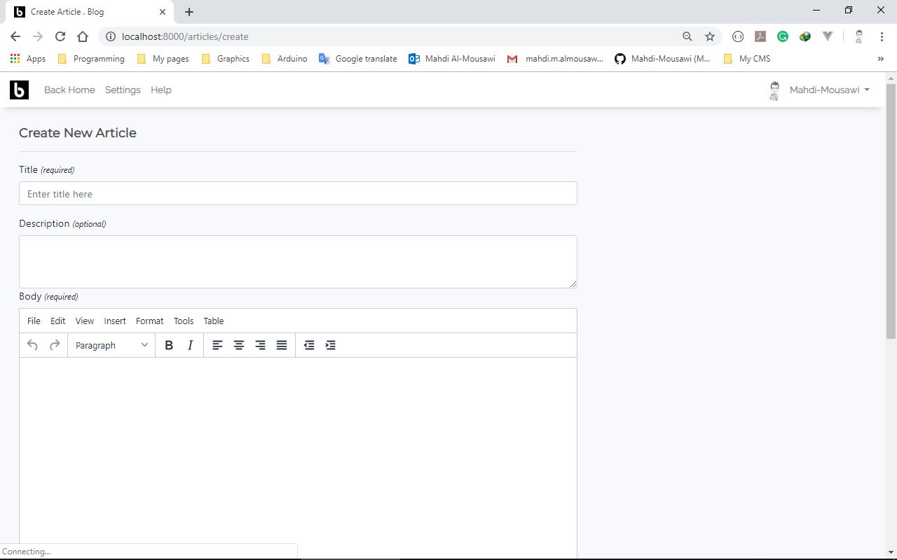
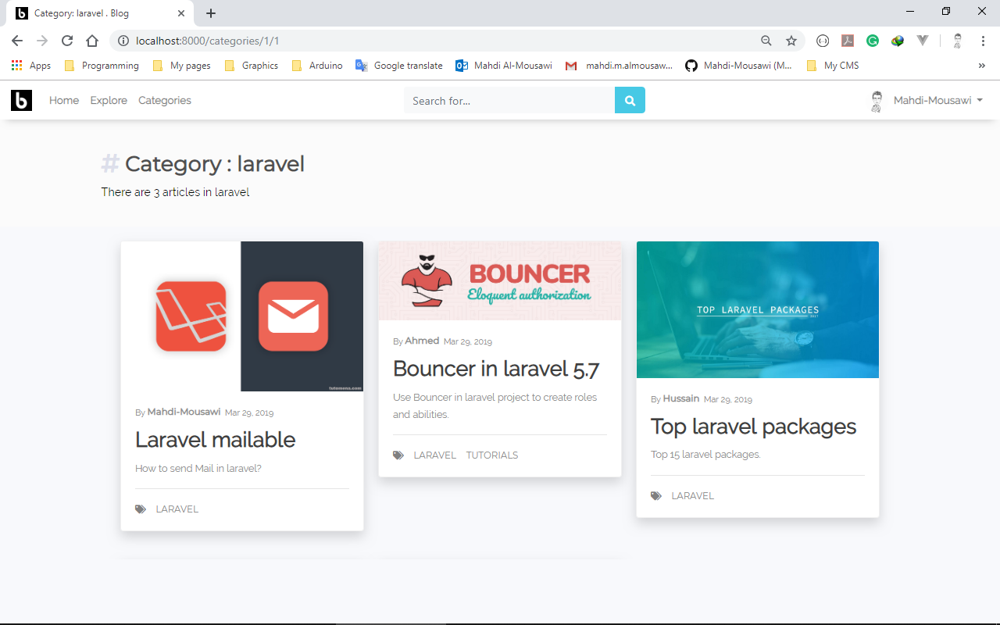
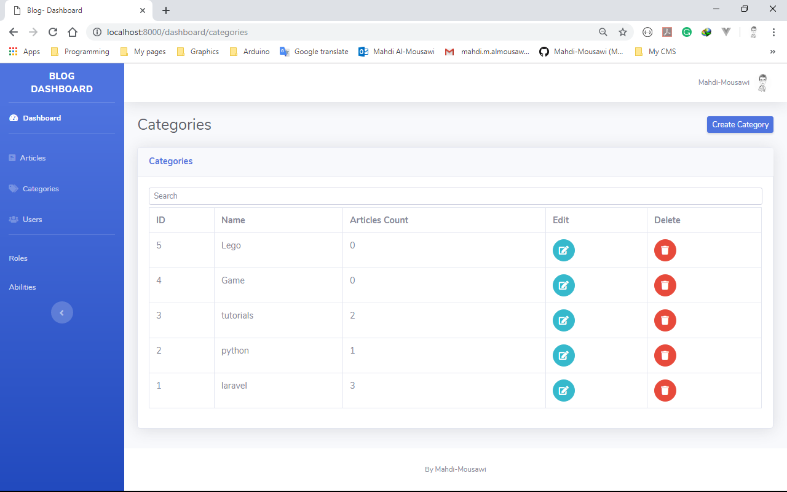
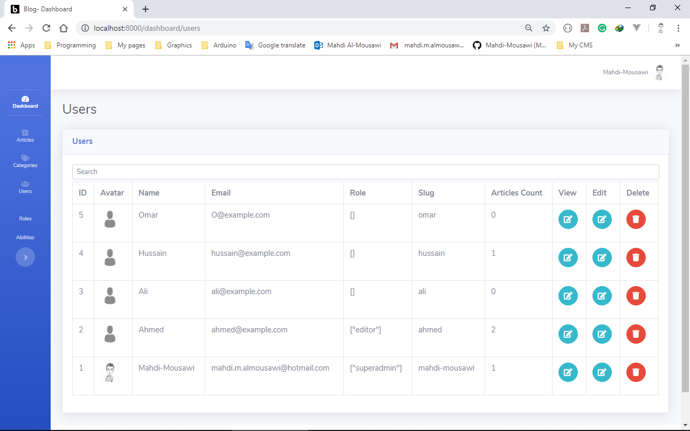

# Laravel Blog 
This is my first project using laravel 5. It's a simple blog. You can register to the blog and create, edit and delete your own articles.
## Used packages
* [Bouncer](https://github.com/JosephSilber/bouncer).
* [Eloquent-Sluggable](https://github.com/cviebrock/eloquent-sluggable).

## Features
1. Anyone can register and login.
2. Each user has a profile.
3. Users can add articles, edit and delete.
4. Event and listeners.
5. Send E-mail to the users whene they create, delete or update their articles.
6. Each user has roles and abilities.
7. You can only edit and delete your own articles so everything is protected.
8. All articles are categorized.
9. Many-to-Many relationship between articles and categories.
10. TinyMCE Editor for beatiful article's content.
11. Bootstrap templates with some custom styles.
12. Dahboard for admin.

## Roles and abilities
Role | Ability
------------ | -------------
SuperAdmin | everything
Editor | Can Create categories. Can delete and edit all articles and users.

## Images

